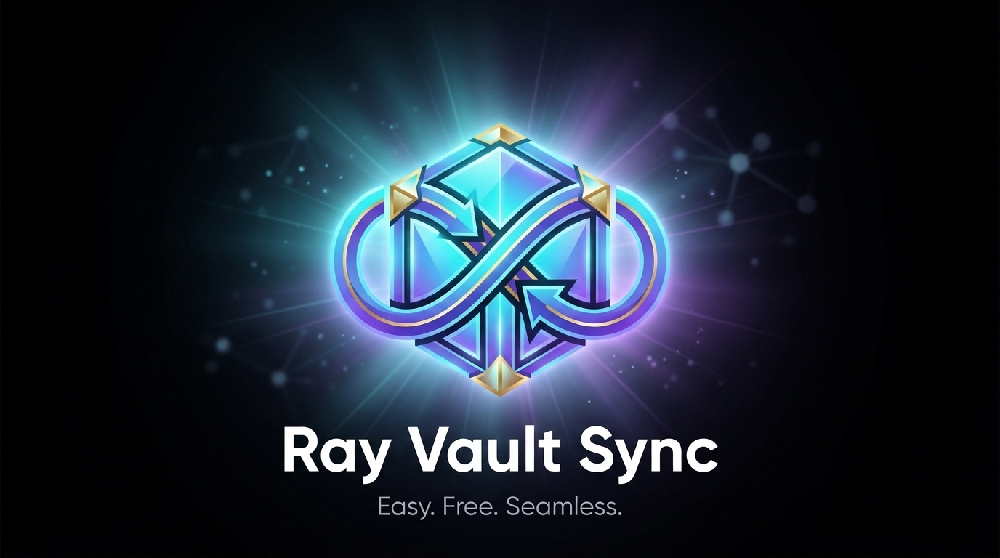

  

<h1 align="center">Ray Vault Sync</h1>

  <b>Easy. Free. Seamless.</b> 
  <i>Lightweight, cross-device GitHub synchronization for your Obsidian vault with 3-way merge and zero silent data loss.</i>

  
  
  

---

## Features

- **Gitless 3-Way Merge**: Synchronizes your vault notes via GitHub's REST API without requiring a local Git CLI, Xcode, or heavy WebAssembly modules.
- **Mobile & Desktop First**: Works effortlessly on iOS, iPadOS, Android, macOS, Windows, and Linux.
- **Zero Silent Data Loss**: Strict conflict safety policy. If the same file is edited concurrently on two devices, both versions are safely preserved (`.conflict-<timestamp>`).
- **Batched Atomic Commits**: Groups changes into 500-item tree chunks and creates a single atomic Git commit per sync batch.
- **Smart Rate-Limit Protection**: Enforces 1-second request throttling and automated cooldown timers to strictly comply with GitHub API secondary rate-limit guidelines.
- **Custom Exclude Patterns**: Easily ignore unwanted folders or files (e.g. `node_modules`, `templates/`, `private/`) via comma-separated settings.
- **Configurable Auto-Sync**: Background auto-sync interval with safety debounce.
- **Diagnostics & Health Check**: Built-in diagnostics tool to verify repository connectivity, permissions, and detect pending diverged files.
- **100% Free & Open Source**: Full control of your private notes backed by your own private GitHub repository.

---

## Quick Start Guide

### Step 1: Generate a GitHub Personal Access Token (PAT)
1. Go to [GitHub Developer Settings > Personal Access Tokens (Fine-grained)](https://github.com/settings/tokens?type=beta).
2. Click **Generate new token**.
3. Set **Repository access** to `Only select repositories` and select your private vault repository (e.g. `ufebri/raylabs-vault`).
4. Under **Repository permissions**, grant **Read and Write** access to **Contents**.
5. Copy the generated token (`github_pat_...`).

### Step 2: Install & Configure the Plugin
1. Install **Ray Vault Sync** in Obsidian (**Settings > Community Plugins**).
2. Open **Settings > Ray Vault Sync**.
3. Enter your **GitHub Personal Access Token**.
4. Enter your **GitHub Repository** (`owner/repo`).
5. (Optional) Configure **Excluded Folders / Patterns** (default: `node_modules, .git, ray-vault-sync`).
6. (Optional) Enable **Auto-Sync** and set your preferred interval in minutes.

### Step 3: Start Syncing!
- Click the **Sync** icon in Obsidian's left ribbon, or press `Cmd+P` / `Ctrl+P` and select `Ray Vault Sync: Sync Now`.

---

## Handling Conflicts

If a file is edited independently on multiple devices without syncing in between, Ray Vault Sync will **never** guess a winner or overwrite your changes.

1. Your local version stays in place: `MyNote.md`.
2. The remote version is downloaded alongside it: `MyNote.conflict-2026-08-25T14-30-00.md`.
3. Open both notes side-by-side in Obsidian, merge your desired text, and delete the `.conflict` file.
4. Click **Sync Now** to finalize the resolution across all devices.

---

## Privacy & Vault Access Disclosure

- **Vault Enumeration (`vault.getFiles`)**: As a dedicated synchronization and backup tool, Ray Vault Sync enumerates files in your vault to calculate local SHA hashes and compare them against your remote GitHub repository tree.
- **Data Privacy**: Your notes and tokens are transmitted directly and exclusively to the official GitHub REST API (`api.github.com`) using your own configured repository and Personal Access Token. No data, telemetry, or analytics are sent to any third-party servers.
- **Local Error Log**: Recent errors are stored locally on your device (`.obsidian/plugins/ray-vault-sync/error-log.json`, tokens redacted). Nothing is uploaded automatically — use Copy in settings to share manually in a GitHub issue.
- **Custom Exclusions**: You can restrict which files or folders are accessed via the **Excluded Folders / Patterns** setting. Hidden files, internal directories (`.obsidian`, `.git`), and excluded patterns are strictly ignored.

---

## Contributing & Development

We welcome contributions! Please check out [CONTRIBUTING.md](CONTRIBUTING.md) for local development setup and architecture guidelines.

---

## Support

If you find Ray Vault Sync helpful, consider supporting its development:

  

---

## License

This project is licensed under the [MIT License](LICENSE) © 2026 Ray.
